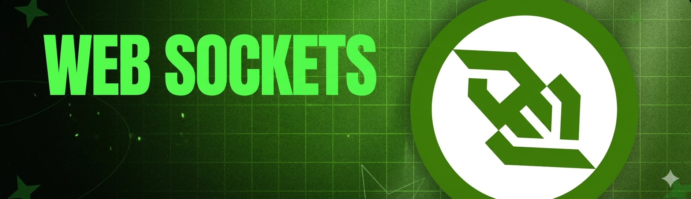

# Sportz Backend

<div align="center">



</div>

<p align="center">


<br/>
  


 
</p>

## 📋 <a name="table">Table of Contents</a>

1. 👋 [Welcome](#welcome)
2. ⚙️ [Tech Stack](#tech-stack)
3. 🔋 [Features](#features)
4. 🤸 [Quick Start](#quick-start)
5. 🧪 [Frontend Testing](#testing)

## <a name="welcome"> 👋 Welcome </a>

Thanks for checking out this sportz backend app. This app is the backend part of a complete full stack web socket application with an [Sportz Frontend](https://github.com/Miki0035/sportz-frontend) backend. This app is from one of JavaScript Mastery Youtube
channel [JavaScript Mastery](https://www.youtube.com/@javascriptmastery) (Shout out to
Adrian and JSMastery team😃 ) highly recommend if you want to upgrade your skills as a full stack developer. Check it out 😮 and let me know what you think.

## <a name="tech-stack">⚙️ Tech Stack </a>

- [Express](https://expressjs.com/)
- [Drizzle ORM](https://orm.drizzle.team/)
- [Neon](https://neon.com/)

## <a name="features">🔋 Features</a>

👉 **REST API** : creating matches , creating commentary on matches.

👉 **WebSocket** : create and connect multiple socket channel

## <a name="quick-start"> 🤸 Quick Start </a>

Follow this steps to setup the project locally on your machine.

**Prerequsites**

Make sure you have the following installed on your machine

- [Git](https://git-scm.com/)
- [Node](https://nodejs.org/en/download)

**Cloning the Repository**

```bash
git clone https://github.com/Miki0035/sportz-websocket
cd sportz-websocket
```

**Installing dependencies**

Run the following command to install all dependencies

```bash
npm install
```

**Environment variables**

In the root of your project

    - create '.env' file
    - add variables similar to the ones located in .env.example

**Running the Project**

Finally run

```bash
npm run dev
```

In your browser go to 'localhost:8000' 👍

## <a name="testing">🧪 Frontend Testing</a>

You can test your backend using

👉 Clone [Sportz Frontend](https://github.com/Miki0035/sportz-frontend)

👉 [wscat](https://www.npmjs.com/package/wscat) - terminal pacakge to test websockects

👉 Using your Browsers console
